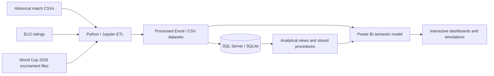

# Solution architecture

## Layers

1. **Sources** — historical international matches, ELO ratings, tournament and venue data.
2. **Processing** — cleaning, standardization, feature engineering and prediction notebooks.
3. **Storage** — normalized SQL schema, analytical views, procedures and a ready-to-use SQLite file.
4. **Analytics** — Power BI reports, Power Score rankings and match/tournament simulations.
5. **Presentation** — dashboard screenshots, video and public documentation.
