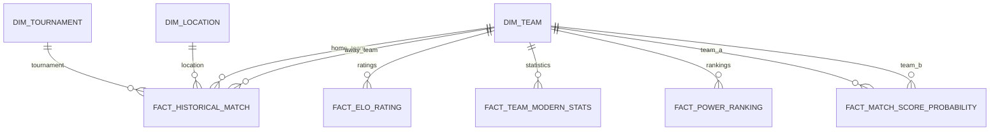

# Entity Relationship Diagram

```mermaid
erDiagram
 DIM_TEAM ||--o{ FACT_HISTORICAL_MATCH : home_team
 DIM_TEAM ||--o{ FACT_HISTORICAL_MATCH : away_team
 DIM_TOURNAMENT ||--o{ FACT_HISTORICAL_MATCH : tournament
 DIM_LOCATION ||--o{ FACT_HISTORICAL_MATCH : location
 DIM_TEAM ||--o{ FACT_ELO_RATING : ratings
 DIM_TEAM ||--o{ FACT_TEAM_MODERN_STATS : statistics
 DIM_TEAM ||--o{ FACT_POWER_RANKING : rankings
 DIM_TEAM ||--o{ FACT_MATCH_SCORE_PROBABILITY : team_a
 DIM_TEAM ||--o{ FACT_MATCH_SCORE_PROBABILITY : team_b
```
