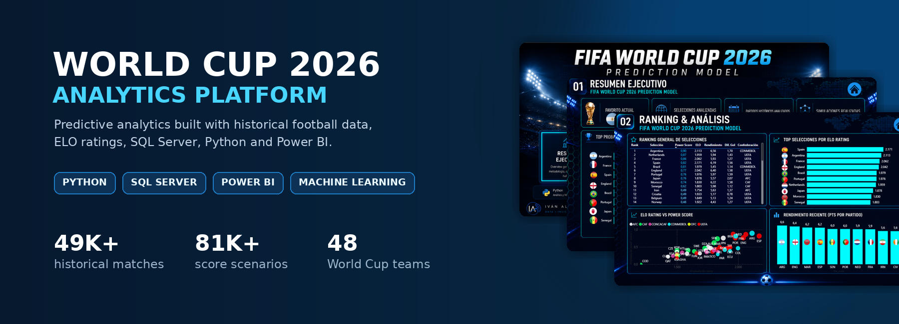

<p align="center">
  
</p>
<h1 align="center">World Cup 2026 SQL Practice Database</h1>
<p align="center">
  Base de datos relacional para practicar SQL, modelado de datos y conexión con Power BI.
</p>
<p align="center">
  <a href="https://github.com/ivanalderete10/world-cup-2026-analytics-platform/releases/tag/v1.0.0-sql">
    
  </a>
  
  
  
</p>
Sobre el proyecto
Este repositorio nació como una evolución de mi proyecto de análisis predictivo del Mundial 2026, desarrollado con Python, Excel y Power BI.
El objetivo de esta versión es ofrecer una base de datos relacional completa y gratuita para que estudiantes y profesionales puedan practicar:
SQL
modelado relacional
claves primarias y foráneas
vistas e índices
procedimientos almacenados
consultas analíticas
conexión de SQL con Power BI
Contenido de la versión SQL v1.0
Métrica	Cantidad
Tablas relacionales	22
Registros totales	140.857
Partidos históricos	49.472
Registros ELO	6.678
Escenarios de marcadores	81.216
Partidos del Mundial 2026	104
Selecciones históricas	459
Selecciones con probabilidades por ronda	48
Descargar
La versión completa está publicada como GitHub Release:
📦 Descargar World Cup 2026 SQL Practice Database v1.0
El ZIP incluye:
```text
database/
  WorldCup2026Analytics.sqlite

sql_server/
  01_create_database_and_schema.sql
  02_bulk_load_normalized_csv.sql
  03_create_indexes_and_views.sql
  04_create_stored_procedures.sql
  05_validate_installation.sql

data/
  CSV normalizados

docs/
  DATA_DICTIONARY.md
  ERD.md
  EXERCISES.md

examples/
  consultas para SQLite
  consultas para SQL Server
```
Uso rápido con SQLite
Descargá la Release.
Descomprimí el ZIP.
Instalá DB Browser for SQLite.
Abrí:
```text
database/WorldCup2026Analytics.sqlite
```
Ejecutá las consultas disponibles en:
```text
examples/01_practice_queries_sqlite.sql
```
Instalación en SQL Server
Ejecutá los scripts en este orden:
```text
01_create_database_and_schema.sql
02_bulk_load_normalized_csv.sql
03_create_indexes_and_views.sql
04_create_stored_procedures.sql
05_validate_installation.sql
```
Antes de ejecutar el segundo script, actualizá la ruta local donde guardaste la carpeta `data`.
Modelo relacional
La base incluye dimensiones para:
selecciones
confederaciones
competencias
ubicaciones
estadios
versiones de modelos
Y tablas de hechos para:
partidos históricos
ratings ELO
rankings y Power Score
fixture del Mundial 2026
posiciones de grupos
escenarios de marcadores
simulaciones y probabilidades por ronda
Ejemplos de análisis
Selecciones con más partidos históricos
Evolución del rating ELO
Historial entre dos selecciones
Marcadores más probables para un cruce
Probabilidades de campeón
Rendimiento por confederación
Comparación entre ELO y Power Score
Autor
Iván Alderete  
Data & Operations Analyst
- LinkedIn: [ivan-augusto-alderete-620658252](https://www.linkedin.com/in/ivan-augusto-alderete-620658252)
- Email: [ivanalderete10@gmail.com](mailto:ivanalderete10@gmail.com)

---
Este proyecto es educativo y no está afiliado oficialmente con FIFA.

---

<p align="center">
  <strong>Data • Insights • Impact</strong>
</p>
