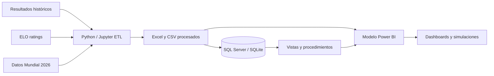

<p align="center">
  
</p>

<p align="center">
  
  
  
  
  
  
</p>

# World Cup 2026 Analytics Platform

> Plataforma integral de analítica deportiva que combina **Python, SQL Server, SQLite, Excel y Power BI** para analizar rendimiento histórico, construir rankings propios y simular partidos y escenarios del Mundial 2026.

[English version](README_EN.md)

## Resumen ejecutivo

Este proyecto transforma más de un siglo de resultados internacionales en una solución analítica de punta a punta. El flujo incluye exploración, limpieza, feature engineering, rankings ELO y Power Score, modelado relacional, consultas SQL, simulaciones y dashboards interactivos.

### Cifras principales

| Métrica | Valor |
|---|---:|
| Partidos históricos | 49.472 |
| Cobertura temporal | 1872–2026 |
| Selecciones históricas normalizadas | 425 |
| Registros ELO | 6.678 |
| Selecciones Mundial 2026 | 48 |
| Escenarios de resultados probables | 81.216 |

## Problema de negocio

¿Cómo convertir datos históricos heterogéneos en información clara para comparar selecciones, evaluar rendimiento reciente y estimar resultados posibles del Mundial 2026?

La solución debía:

- Unificar nombres y entidades de selecciones.
- Integrar resultados históricos, ELO y métricas modernas.
- Construir indicadores comparables y explicables.
- Permitir análisis SQL y conexión con Power BI.
- Presentar escenarios predictivos sin afirmar certezas deportivas.

## Arquitectura



Más detalle: [docs/ARCHITECTURE.md](docs/ARCHITECTURE.md)

## Componentes del proyecto

### Python y notebooks

- Exploración y validación de datos.
- Métricas modernas de rendimiento.
- Feature engineering.
- Power Score y rankings.
- Conexión con datos actualizables.
- Simulación de partidos y torneo.

### SQL

- Esquema relacional con claves y restricciones.
- Carga de datasets analíticos.
- Vistas orientadas a reporting.
- Stored procedures para consultas recurrentes.
- Base SQLite lista para explorar sin servidor.
- Consultas y ejercicios para aprendizaje.

### Power BI

- Resumen ejecutivo.
- Ranking y análisis de selecciones.
- Simulador de partidos.
- Simulación del torneo.
- Evolución y tendencias.

## Capturas

<p align="center">
  
  
</p>
<p align="center">
  
  
</p>

## Estructura

```text
World-Cup-2026-Analytics-Platform/
├── assets/                 # Banner y logo originales
├── data/
│   ├── raw/                # Resultados históricos y ELO
│   ├── processed/          # Datasets preparados para análisis
│   └── sql/                # CSV normalizados y SQLite
├── docs/                   # Arquitectura, ERD, diccionario y ejercicios
│   └── screenshots/        # Capturas del dashboard
├── examples/               # Consultas SQL resueltas
├── notebooks/              # Flujo analítico en Jupyter
├── powerbi/                # Archivos PBIX
├── sql/                    # Esquema, carga, vistas y procedimientos
├── video/                  # Demostración del dashboard
├── README.md
├── README_EN.md
├── requirements.txt
└── LICENSE
```

## Uso rápido

### Opción A — SQLite

Abrí `data/sql/WorldCup2026Analytics.sqlite` con DB Browser for SQLite o una extensión SQL compatible.

### Opción B — SQL Server

Ejecutá en orden:

1. `sql/01_create_database_and_core_schema.sql`
2. `sql/02_bulk_load_core_data.sql`
3. `sql/03_views.sql`
4. `sql/04_stored_procedures.sql`

> La carga masiva puede requerir ajustar las rutas de archivos según tu equipo.

### Opción C — Python

```bash
python -m venv .venv
# Windows
.venv\Scripts\activate
pip install -r requirements.txt
jupyter notebook
```

## Documentación

- [Arquitectura](docs/ARCHITECTURE.md)
- [Modelo entidad–relación](docs/ERD.md)
- [Diccionario de datos](docs/DATA_DICTIONARY.md)
- [Ejercicios SQL](docs/EXERCISES.md)
- [Consultas de práctica](examples/practice_queries.sql)

## Alcance y limitaciones

- Es un proyecto educativo y de portfolio.
- Los resultados predictivos son escenarios analíticos, no pronósticos garantizados.
- La identidad visual es original y no pretende representar ni estar afiliada a FIFA.
- Antes de reutilizar datasets externos, verificá sus términos y licencias originales.

## Autor

**Iván Alderete** — Data & Operations Analyst  
Power BI · Excel · SQL · Python · Reporting · Process Improvement

- LinkedIn: `linkedin.com/in/ivan-augusto-alderete-620658252`
- Email: `ivanalderete10@gmail.com`
