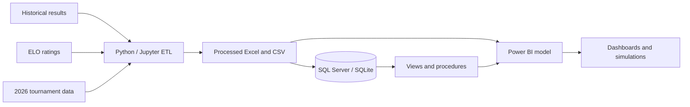

<p align="center">
  
</p>

<p align="center">
  
  
  
  
  
</p>

# World Cup 2026 Analytics Platform

> End-to-end sports analytics platform combining **Python, SQL Server, SQLite, Excel and Power BI** to analyze historical performance, build custom rankings and simulate 2026 World Cup matches and tournament scenarios.

[Versión en español](README.md)

## Executive overview

The project converts more than a century of international football results into a documented analytical solution. It covers exploration, cleaning, feature engineering, ELO and Power Score rankings, relational database design, SQL analysis, simulations and interactive dashboards.

| Metric | Value |
|---|---:|
| Historical matches | 49,472 |
| Time coverage | 1872–2026 |
| Normalized historical teams | 425 |
| ELO records | 6,678 |
| 2026 World Cup teams | 48 |
| Probable score scenarios | 81,216 |

## Business question

How can heterogeneous historical data be transformed into clear insights for comparing national teams, evaluating recent performance and estimating possible 2026 World Cup outcomes?

## Architecture



## Main capabilities

- Historical and modern team-performance analysis.
- ELO and custom Power Score rankings.
- Normalized SQL schema and ready-to-use SQLite database.
- Analytical views, stored procedures and practice queries.
- Power BI report with ranking, match simulator and tournament simulation pages.
- Documentation, exercises and reproducible notebooks.

## Quick start

### SQLite

Open `data/sql/WorldCup2026Analytics.sqlite` using DB Browser for SQLite.

### SQL Server

Run the scripts in this order:

1. `sql/01_create_database_and_core_schema.sql`
2. `sql/02_bulk_load_core_data.sql`
3. `sql/03_views.sql`
4. `sql/04_stored_procedures.sql`

### Python

```bash
python -m venv .venv
# Windows
.venv\Scripts\activate
pip install -r requirements.txt
jupyter notebook
```

## Documentation

- [Architecture](docs/ARCHITECTURE.md)
- [Entity–relationship model](docs/ERD.md)
- [Data dictionary](docs/DATA_DICTIONARY.md)
- [SQL exercises](docs/EXERCISES.md)

## Author

**Iván Alderete** — Data & Operations Analyst  
Power BI · Excel · SQL · Python · Reporting · Process Improvement

- LinkedIn: `linkedin.com/in/ivan-augusto-alderete-620658252`
- Email: `ivanalderete10@gmail.com`
